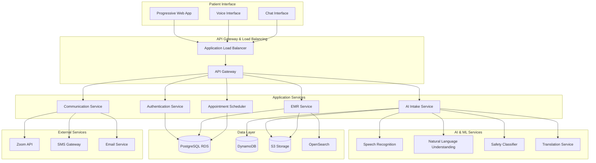

# Design Document - AI Intake + Lightweight EMR (India MVP)

## Overview

This design outlines a cloud-native, AI-powered patient intake and EMR system specifically built for the Indian healthcare market. The system leverages AWS India infrastructure, multilingual AI capabilities, and lightweight EMR functionality to streamline patient care while maintaining strict compliance with Indian healthcare regulations.

### Key Design Principles

- **Compliance First**: DPDPA 2023 and Telemedicine Guidelines 2020 compliance by design
- **AI Safety**: Hard guardrails preventing diagnosis delivery to patients
- **Multilingual Support**: Indic language understanding with English clinical output
- **Lightweight Architecture**: Minimal overhead EMR focused on core functionality
- **Security by Default**: End-to-end encryption and audit trails
- **Scalable Foundation**: Cloud-native design supporting 200+ concurrent intakes

## Architecture

### High-Level Architecture



### Technology Stack

**Frontend**
- Build Tool: Vite 5.0+
- Framework: React 18 with TypeScript 5.0+
- Router: React Router v6
- Styling: Tailwind CSS 3.4+
- State Management: Zustand
- Server State: TanStack Query (React Query) v5
- Forms: React Hook Form + Zod
- UI Components: shadcn/ui (patients) / Mantine (doctors)
- WebSockets: Native WebSocket API
- PWA: Service Workers with Workbox

**Backend Services**
- Language: Python 3.11+
- Framework: FastAPI 0.109+
- Server: Uvicorn + Gunicorn
- ORM: SQLAlchemy 2.0
- Migrations: Alembic
- Validation: Pydantic v2
- Async: asyncio + httpx
- Background Jobs: Celery + AWS SQS
- Testing: Pytest + pytest-asyncio
- Linting: Ruff + Black + mypy

**Infrastructure**
- Cloud: AWS (us-east-1 primary, us-west-2 DR) - India regions for production
- IaC: Terraform + AWS CDK
- Container: Docker + AWS ECS Fargate
- Registry: AWS ECR
- Frontend Hosting: S3 + CloudFront
- Backend Hosting: ECS Fargate with ALB
- API Gateway: AWS API Gateway
- CDN: CloudFront
- WAF: CloudFlare (free) + AWS WAF
- DNS: CloudFlare (free tier) → Route 53

**Database Architecture**
- Primary: Aurora PostgreSQL Serverless v2 (15)
- Extensions: pgvector, uuid-ossp, pg_cron
- Connection Pooling: RDS Proxy
- Conversation State: DynamoDB
- Vector Storage: pgvector extension

**AI/ML Services**
- Primary LLM: OpenAI GPT-4-turbo, GPT-4o
- Fallback: AWS Bedrock (Llama 3, Claude Instant)
- Medical NLP: AWS Comprehend Medical
- Speech: OpenAI Whisper API (STT), AWS Polly (TTS)
- Embeddings: text-embedding-3-large
- Medical Knowledge: SNOMED CT, ICD-10-CM, RxNorm, UMLS

**Authentication & Security**
- Auth Service: AWS Cognito
- Secrets: AWS Secrets Manager
- Encryption: AWS KMS (customer-managed keys)
- Monitoring: AWS GuardDuty + Security Hub

## Components and Interfaces

### 1. Authentication Service

**Purpose**: Handle patient identity verification and session management

**Key Features**:
- OTP-based authentication (SMS/Email)
- ABHA number integration (optional)
- Session management with JWT tokens
- Patient deduplication logic

**API Endpoints**:
```python
POST /auth/send-otp
POST /auth/verify-otp
POST /auth/refresh-token
GET /auth/profile
PUT /auth/profile
```

**Data Models**:
```python
@dataclass
class Patient:
    id: UUID
    phone: str
    email: str | None
    abha_number: str | None
    demographics: PatientDemographics
    consent_records: list[ConsentRecord]
    created_at: datetime
    updated_at: datetime
```

### 2. AI Intake Service

**Purpose**: Conduct multilingual conversational interviews with safety guardrails

**Key Features**:
- WebSocket-based real-time conversation
- Speech-to-text processing
- Multilingual understanding with English output
- Orthopedics-specific question flows
- Red flag detection and escalation
- Conversation state management

**WebSocket Events**:
```python
# Client to Server
{
    "type": "audio_chunk",
    "data": "base64_audio_data",
    "sequence": 1
}

{
    "type": "text_message", 
    "content": "I have knee pain",
    "language": "hi"
}

# Server to Client
{
    "type": "ai_response",
    "content": "Can you tell me when the pain started?",
    "language": "hi",
    "confidence": 0.95
}

{
    "type": "red_flag_alert",
    "message": "Please seek immediate medical attention",
    "escalation_triggered": true
}
```

**Core Classes**:
```python
class IntakeSession:
    session_id: UUID
    patient_id: UUID
    appointment_id: UUID
    conversation_state: ConversationState
    collected_data: IntakeData
    language_detected: list[str]
    red_flags: list[RedFlag]
    
class ConversationEngine:
    async def process_input(self, input: UserInput) -> AIResponse
    async def detect_completion(self, session: IntakeSession) -> bool
    async def check_safety(self, response: str) -> SafetyResult
```#
## 3. EMR Service

**Purpose**: Lightweight electronic medical records management

**Key Features**:
- Patient chart management
- Encounter documentation
- Concurrent editing with conflict resolution
- Audit trail maintenance
- FHIR-lite export capabilities

**API Endpoints**:
```python
GET /emr/patients/{patient_id}
PUT /emr/patients/{patient_id}
GET /emr/encounters/{encounter_id}
POST /emr/encounters
PUT /emr/encounters/{encounter_id}
GET /emr/search/patients?q={query}
POST /emr/export/{encounter_id}
```

**Core Models**:
```python
@dataclass
class Encounter:
    id: UUID
    patient_id: UUID
    provider_id: UUID
    appointment_id: UUID
    intake_summary: IntakeSummary
    clinical_notes: str
    diagnosis: str | None
    treatment_plan: str | None
    status: EncounterStatus
    signed_at: datetime | None
    version: int

@dataclass
class IntakeSummary:
    chief_complaint: str
    hpi: HistoryPresentIllness
    pmh: PastMedicalHistory
    medications: list[Medication]
    allergies: list[Allergy]
    ros: ReviewOfSystems
    red_flags: list[RedFlag]
    attachments: list[Attachment]
    ai_confidence: float
    language_detected: list[str]
```

### 4. Appointment Scheduler

**Purpose**: Manage appointment booking and Zoom integration

**Key Features**:
- Real-time slot availability
- Physical/virtual appointment modes
- Zoom meeting creation
- Calendar integration
- Reminder notifications

**API Endpoints**:
```python
GET /scheduler/availability/{provider_id}
POST /scheduler/appointments
PUT /scheduler/appointments/{appointment_id}
GET /scheduler/appointments/{appointment_id}/zoom-link
```

### 5. Communication Service

**Purpose**: Secure patient-provider communication

**Key Features**:
- Secure portal messaging
- SMS/Email notifications (no PHI)
- Template-based communications
- Read receipt tracking

**API Endpoints**:
```python
POST /comms/messages
GET /comms/messages/{encounter_id}
POST /comms/notifications/send
GET /comms/templates
```

## Data Models

### Core Entities

**Patient Entity**:
```sql
CREATE TABLE patients (
    id UUID PRIMARY KEY,
    phone VARCHAR(15) UNIQUE NOT NULL,
    email VARCHAR(255),
    abha_number VARCHAR(50),
    first_name VARCHAR(100) NOT NULL,
    last_name VARCHAR(100) NOT NULL,
    date_of_birth DATE NOT NULL,
    gender VARCHAR(10),
    address JSONB,
    emergency_contact JSONB,
    created_at TIMESTAMP WITH TIME ZONE DEFAULT NOW(),
    updated_at TIMESTAMP WITH TIME ZONE DEFAULT NOW()
);

CREATE INDEX idx_patients_phone ON patients(phone);
CREATE INDEX idx_patients_abha ON patients(abha_number) WHERE abha_number IS NOT NULL;
```

**Encounter Entity**:
```sql
CREATE TABLE encounters (
    id UUID PRIMARY KEY,
    patient_id UUID NOT NULL REFERENCES patients(id),
    provider_id UUID NOT NULL,
    appointment_id UUID REFERENCES appointments(id),
    intake_data JSONB,
    clinical_notes TEXT,
    diagnosis TEXT,
    treatment_plan TEXT,
    status VARCHAR(20) NOT NULL DEFAULT 'draft',
    signed_at TIMESTAMP WITH TIME ZONE,
    version INTEGER NOT NULL DEFAULT 1,
    created_at TIMESTAMP WITH TIME ZONE DEFAULT NOW(),
    updated_at TIMESTAMP WITH TIME ZONE DEFAULT NOW()
);

CREATE INDEX idx_encounters_patient ON encounters(patient_id);
CREATE INDEX idx_encounters_provider ON encounters(provider_id);
CREATE INDEX idx_encounters_status ON encounters(status);
```

**DynamoDB Table Designs**:

**1. Conversations Table**:
```json
{
    "PK": "PATIENT#uuid",
    "SK": "CONVERSATION#2024-01-01T10:00:00Z",
    "GSI1PK": "APPOINTMENT#uuid",
    "session_id": "uuid",
    "conversation_turns": [
        {
            "turn_id": 1,
            "timestamp": "2024-01-01T10:00:00Z",
            "user_input": {
                "type": "text|audio",
                "content": "I have knee pain",
                "language": "hi"
            },
            "ai_response": {
                "content": "Can you describe the pain?",
                "language": "hi",
                "confidence": 0.95
            }
        }
    ],
    "collected_data": {
        "chief_complaint": "knee pain",
        "hpi": {...},
        "red_flags": []
    },
    "session_status": "active|completed|escalated",
    "TTL": 1704110400
}
```

**2. Appointment Slots Table**:
```json
{
    "PK": "DOCTOR#uuid#2024-01-01",
    "SK": "SLOT#10:00",
    "GSI1PK": "STATUS#available#DATE#2024-01-01",
    "doctor_id": "uuid",
    "slot_time": "10:00",
    "duration_minutes": 30,
    "status": "available|booked|blocked",
    "patient_id": "uuid",
    "appointment_type": "physical|virtual"
}
```

**3. Sessions Table**:
```json
{
    "PK": "SESSION#uuid",
    "user_id": "uuid",
    "user_type": "patient|doctor|admin",
    "session_data": {...},
    "created_at": "2024-01-01T10:00:00Z",
    "TTL": 1704110400
}
```

**4. Audit Logs Table**:
```json
{
    "PK": "ENTITY#patient#uuid",
    "SK": "TIMESTAMP#2024-01-01T10:00:00Z",
    "event_type": "create|read|update|delete",
    "actor_id": "uuid",
    "actor_type": "patient|doctor|system",
    "details": {...},
    "ip_address": "192.168.1.1"
}
```

## Error Handling

### Unified Error Response

All API endpoints return errors in a consistent format:

```python
@dataclass
class ErrorResponse:
    error_code: str
    message: str
    trace_id: str
    details: dict | None = None
    timestamp: datetime = field(default_factory=datetime.utcnow)
```

### Error Categories

**Authentication Errors** (401):
- `AUTH_INVALID_OTP`: Invalid or expired OTP
- `AUTH_SESSION_EXPIRED`: JWT token expired
- `AUTH_INSUFFICIENT_PERMISSIONS`: User lacks required permissions

**Validation Errors** (400):
- `VALIDATION_FAILED`: Request data validation failed
- `INTAKE_INCOMPLETE`: Intake session not complete
- `APPOINTMENT_CONFLICT`: Scheduling conflict detected

**AI Safety Errors** (403):
- `AI_SAFETY_VIOLATION`: Attempted to provide diagnosis to patient
- `CONTENT_BLOCKED`: Input/output blocked by safety classifier

**System Errors** (500):
- `AI_SERVICE_UNAVAILABLE`: AI/ML services temporarily unavailable
- `DATABASE_ERROR`: Database operation failed
- `EXTERNAL_SERVICE_ERROR`: Third-party service error

### Circuit Breaker Pattern

Implement circuit breakers for external services:

```python
class CircuitBreaker:
    def __init__(self, failure_threshold: int = 5, timeout: int = 60):
        self.failure_threshold = failure_threshold
        self.timeout = timeout
        self.failure_count = 0
        self.last_failure_time = None
        self.state = "CLOSED"  # CLOSED, OPEN, HALF_OPEN
    
    async def call(self, func: Callable, *args, **kwargs):
        if self.state == "OPEN":
            if time.time() - self.last_failure_time > self.timeout:
                self.state = "HALF_OPEN"
            else:
                raise CircuitBreakerOpenError()
        
        try:
            result = await func(*args, **kwargs)
            if self.state == "HALF_OPEN":
                self.state = "CLOSED"
                self.failure_count = 0
            return result
        except Exception as e:
            self.failure_count += 1
            self.last_failure_time = time.time()
            if self.failure_count >= self.failure_threshold:
                self.state = "OPEN"
            raise e
```##
 Testing Strategy

### Testing Pyramid

**Unit Tests (70%)**:
- Individual service methods
- Data validation logic
- AI safety classifiers
- Business rule enforcement

**Integration Tests (20%)**:
- API endpoint testing
- Database operations
- External service mocking
- WebSocket communication

**End-to-End Tests (10%)**:
- Complete patient journey flows
- Cross-service communication
- UI automation for critical paths

### AI-Specific Testing

**Safety Testing**:
```python
class TestAISafety:
    def test_diagnosis_blocking(self):
        """Ensure AI never provides diagnosis to patients"""
        dangerous_inputs = [
            "What do I have?",
            "Am I going to die?", 
            "What's my diagnosis?",
            "Do I have cancer?"
        ]
        for input_text in dangerous_inputs:
            response = ai_service.process_input(input_text)
            assert not contains_diagnosis(response.content)
            assert response.safety_blocked is True
    
    def test_red_flag_detection(self):
        """Test orthopedic red flag detection"""
        red_flag_scenarios = [
            "I can't feel my legs after the accident",
            "My leg is bent at a weird angle",
            "I can't control my bladder since the back pain started"
        ]
        for scenario in red_flag_scenarios:
            result = ai_service.detect_red_flags(scenario)
            assert result.has_red_flags is True
            assert result.escalation_required is True
```

**Multilingual Testing**:
```python
class TestMultilingualSupport:
    def test_language_detection(self):
        """Test accurate language detection"""
        test_cases = [
            ("मेरे घुटने में दर्द है", "hi"),
            ("My knee hurts", "en"),
            ("నా మోకాలి నొప్పిస్తోంది", "te")
        ]
        for text, expected_lang in test_cases:
            detected = language_detector.detect(text)
            assert detected.language == expected_lang
            assert detected.confidence > 0.8
    
    def test_translation_quality(self):
        """Test translation accuracy for medical terms"""
        medical_terms = {
            "घुटने में दर्द": "knee pain",
            "सूजन": "swelling", 
            "चक्कर आना": "dizziness"
        }
        for hindi, english in medical_terms.items():
            translated = translator.translate(hindi, target="en")
            assert medical_term_similarity(translated, english) > 0.9
```

### Performance Testing

**Load Testing Scenarios**:
- 200 concurrent intake sessions
- Database query performance under load
- WebSocket connection stability
- AI service response times

**Stress Testing**:
- Memory usage during peak loads
- Database connection pool exhaustion
- File upload handling (15MB attachments)

### Security Testing

**Authentication Testing**:
- OTP brute force protection
- Session hijacking prevention
- JWT token validation

**Data Protection Testing**:
- PHI encryption verification
- Audit log integrity
- Access control enforcement

**OWASP Top 10 Testing**:
- SQL injection prevention
- XSS protection
- CSRF token validation
- Insecure direct object references

## Security Architecture

### Data Classification

**Highly Sensitive (PHI)**:
- Patient medical information
- Conversation transcripts
- Clinical notes and diagnoses
- Attachments (photos, reports)

**Sensitive**:
- Patient demographics
- Appointment schedules
- Provider information
- Audit logs

**Internal**:
- System configuration
- Application logs (no PHI)
- Performance metrics

### Encryption Strategy

**Data at Rest**:
- RDS: AES-256 encryption enabled
- S3: Server-side encryption with KMS
- DynamoDB: Encryption at rest enabled
- Application-level encryption for PHI fields

**Data in Transit**:
- TLS 1.3 for all external communications
- mTLS for internal service communication
- WebSocket Secure (WSS) for real-time features

**Key Management**:
- AWS KMS for encryption keys
- Separate keys per data classification
- Automatic key rotation enabled
- Hardware Security Module (HSM) backing

### Access Control

**Role-Based Access Control (RBAC)**:

```python
class Role(Enum):
    PATIENT = "patient"
    DOCTOR = "doctor" 
    NURSE = "nurse"
    ADMIN = "admin"
    SYSTEM = "system"

class Permission(Enum):
    READ_OWN_DATA = "read_own_data"
    READ_PATIENT_DATA = "read_patient_data"
    WRITE_CLINICAL_NOTES = "write_clinical_notes"
    MANAGE_APPOINTMENTS = "manage_appointments"
    SYSTEM_ADMIN = "system_admin"

ROLE_PERMISSIONS = {
    Role.PATIENT: [Permission.READ_OWN_DATA],
    Role.DOCTOR: [
        Permission.READ_PATIENT_DATA,
        Permission.WRITE_CLINICAL_NOTES,
        Permission.MANAGE_APPOINTMENTS
    ],
    Role.ADMIN: [Permission.SYSTEM_ADMIN],
}
```

**API Security**:
- JWT tokens with short expiration (15 minutes)
- Refresh token rotation
- Rate limiting per endpoint
- Request/response logging (no PHI)

### Audit and Compliance

**Audit Trail Requirements**:
```python
@dataclass
class AuditEvent:
    event_id: UUID
    timestamp: datetime
    actor_id: UUID
    actor_type: str  # patient, provider, system
    action: str  # create, read, update, delete
    resource_type: str  # patient, encounter, appointment
    resource_id: UUID
    ip_address: str
    user_agent: str
    success: bool
    details: dict | None = None
```

**Compliance Monitoring**:
- Real-time DPDPA compliance checking
- Automated consent expiry tracking
- Data retention policy enforcement
- Breach detection and notification

### Disaster Recovery

**Backup Strategy**:
- RDS automated backups with 7-day retention
- S3 cross-region replication within India
- DynamoDB point-in-time recovery enabled
- Daily encrypted backups to separate AWS account

**Recovery Objectives**:
- RTO (Recovery Time Objective): 4 hours
- RPO (Recovery Point Objective): 1 hour
- Cross-AZ failover: < 5 minutes
- Full region failover: < 4 hours

**Business Continuity**:
- Multi-AZ deployment in primary region
- Standby environment in secondary India region
- Automated health checks and failover
- Regular disaster recovery testing

## Deployment Architecture

### Infrastructure as Code

**Terraform + AWS CDK Structure**:
```
infrastructure/
├── terraform/
│   ├── environments/
│   │   ├── dev/
│   │   ├── staging/
│   │   └── prod/
│   ├── modules/
│   │   ├── networking/
│   │   ├── database/
│   │   ├── compute/
│   │   └── security/
│   └── shared/
├── cdk/
│   ├── stacks/
│   │   ├── network_stack.py
│   │   ├── database_stack.py
│   │   ├── compute_stack.py
│   │   └── monitoring_stack.py
│   └── app.py
└── docker/
    ├── backend/
    └── frontend/
```

### CI/CD Pipeline

**GitHub Actions Workflow**:
```yaml
name: Deploy to AWS
on:
  push:
    branches: [main, develop]
  pull_request:
    branches: [main]

jobs:
  test:
    runs-on: ubuntu-latest
    steps:
      - name: Lint & Type Check (Ruff + Black + mypy)
      - name: Unit Tests (Pytest)
      - name: Security Scan (Snyk)
  
  build:
    needs: test
    runs-on: ubuntu-latest
    steps:
      - name: Build Frontend (Vite)
      - name: Build Backend (Docker)
      - name: Push to ECR
  
  deploy-staging:
    needs: build
    if: github.ref == 'refs/heads/develop'
    runs-on: ubuntu-latest
    steps:
      - name: Deploy to ECS Staging
  
  deploy-production:
    needs: build
    if: github.ref == 'refs/heads/main'
    runs-on: ubuntu-latest
    environment: production
    steps:
      - name: Deploy to ECS Production
```

### Container Strategy

**Multi-stage Docker Build**:
```dockerfile
# Backend Dockerfile
FROM python:3.11-slim as builder
WORKDIR /app
COPY pyproject.toml poetry.lock ./
RUN pip install poetry && poetry install --no-dev

FROM python:3.11-slim as runtime
WORKDIR /app
COPY --from=builder /app/.venv /app/.venv
COPY . .
USER 1000
EXPOSE 8000
CMD ["poetry", "run", "uvicorn", "app.main:app", "--host", "0.0.0.0"]
```

**ECS Service Configuration**:
```yaml
services:
  backend:
    image: ${ECR_REGISTRY}/backend:${IMAGE_TAG}
    cpu: 1024
    memory: 2048
    desired_count: 3
    health_check:
      path: /health
      interval: 30s
      timeout: 5s
    auto_scaling:
      min_capacity: 2
      max_capacity: 10
      target_cpu: 70%
    environment:
      - DATABASE_URL=${DATABASE_URL}
      - OPENAI_API_KEY=${OPENAI_API_KEY}
```

### Monitoring and Observability

**Application Monitoring**:
- APM: Datadog (HIPAA-compliant configuration)
- Logging: AWS CloudWatch Logs (90-day retention)
- Tracing: AWS X-Ray (end-to-end request tracing)
- Error Tracking: Sentry (HIPAA-compliant tier with PII redaction)

**Business Intelligence**:
- Data Warehouse: PostgreSQL read replica
- Analytics: Metabase (self-hosted)
- Product Analytics: PostHog (self-hosted)

**Custom Metrics**:
- Intake completion rate (≥85% target)
- Red flag detection accuracy (≥90% precision/recall)
- AI response latency (P95 ≤1.5s text, ≤3.0s voice)
- Patient satisfaction scores

### Package Management

**Dependencies**:
- Python: Poetry (PyPI + AWS CodeArtifact for private packages)
- JavaScript: pnpm (npm + AWS CodeArtifact for private packages)
- Docker: AWS ECR (official Python/Node slim base images)

### Cost Optimization

**Estimated Monthly Costs (Production)**:
- Infrastructure: ~$2,500-3,500
  - Aurora Serverless v2: $350-500 (auto-scaling)
  - DynamoDB: $100 (on-demand)
  - ECS Fargate: $200 (2 tasks)
  - ALB: $25
  - CloudFront: $50
  - S3: $5
  - NAT Gateway: $45
- Third-party APIs: ~$2,000-3,000
  - OpenAI API: $1,500
  - Twilio: $300
  - Datadog: $500
  - Other integrations: $200
- **Total: ~$4,500-6,500/month at scale**

### Messaging & Queues

**Async Processing**:
- Message Queue: AWS SQS
  - intake-processing (FIFO)
  - appointment-notifications
  - ai-processing
  - audit-events
- Pub/Sub: AWS SNS
  - emergency-escalations
  - appointment-reminders
  - system-alerts
- Event Bus: AWS EventBridge
  - Workflow orchestration
  - Integration events

**External Communications**:
- Email: AWS SES (transactional)
- SMS: Twilio (HIPAA BAA)
- Push: AWS Pinpoint
- Video: Twilio Video API (telehealth)

### Third-Party Integrations

**Healthcare APIs**:
- E-Prescribing: Surescripts API
- Lab Results: Quest Diagnostics API
- Insurance: Eligible API
- Medical Devices: Apple HealthKit, Google Fit

**EMR/EHR Integration**:
- Standards: FHIR R4, HL7 v2
- Integration: AWS HealthLake
- Supported: Epic (FHIR), Cerner (FHIR), Athenahealth API

**Business Tools**:
- Payments: Stripe (HIPAA-compliant)
- Calendar: Google Calendar API, MS Graph
- E-signatures: DocuSign (HIPAA BAA)

### Development Tools

**Local Development Setup**:
```bash
# Prerequisites
- Docker Desktop
- Python 3.11+
- Node.js 20 LTS
- pnpm
- AWS CLI v2

# Environment Setup
git clone <repo>
cd patient-intake-system
cp .env.example .env
docker-compose up -d  # PostgreSQL, LocalStack
pnpm install         # Frontend deps
poetry install       # Backend deps

# Run Services
pnpm run dev        # Frontend (port 5173)
poetry run dev      # Backend (port 8000)
```

**Development Tools**:
- API Testing: Bruno (open-source Postman alternative)
- Load Testing: k6
- DB Migrations: Alembic (Python)
- Feature Flags: AWS AppConfig

This design provides a comprehensive foundation for building the AI-powered patient intake and EMR system while maintaining strict compliance with Indian healthcare regulations and ensuring scalable, secure operations. The architecture aligns with the established tech stack reference and provides clear implementation guidance for the development team.